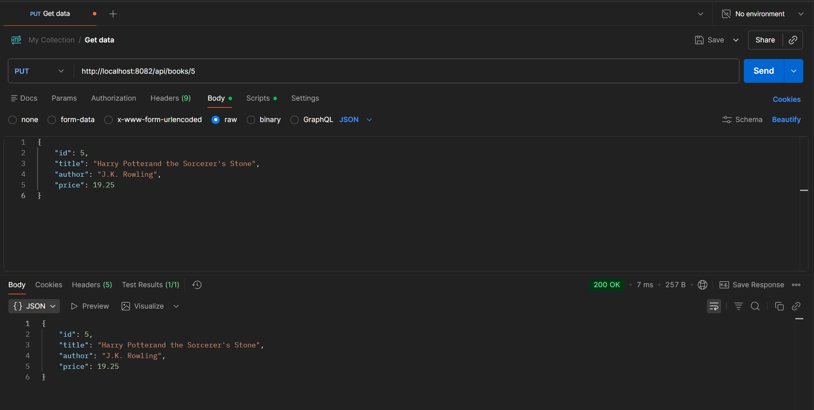
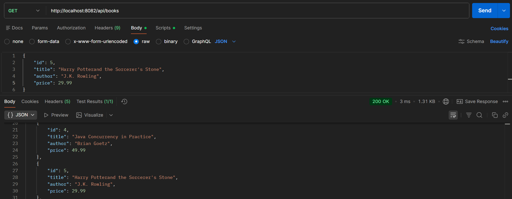
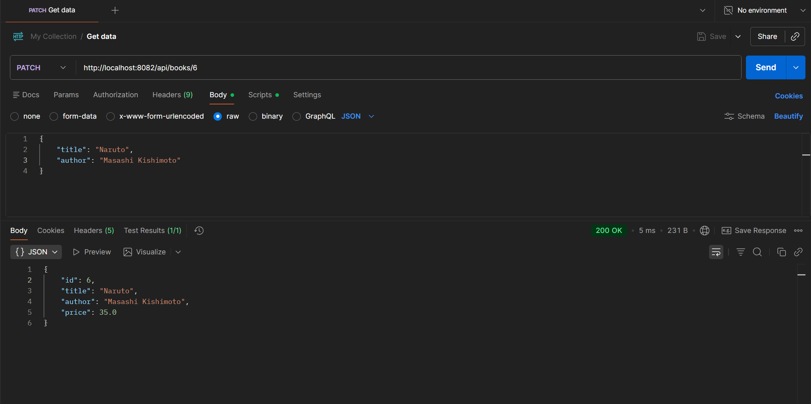
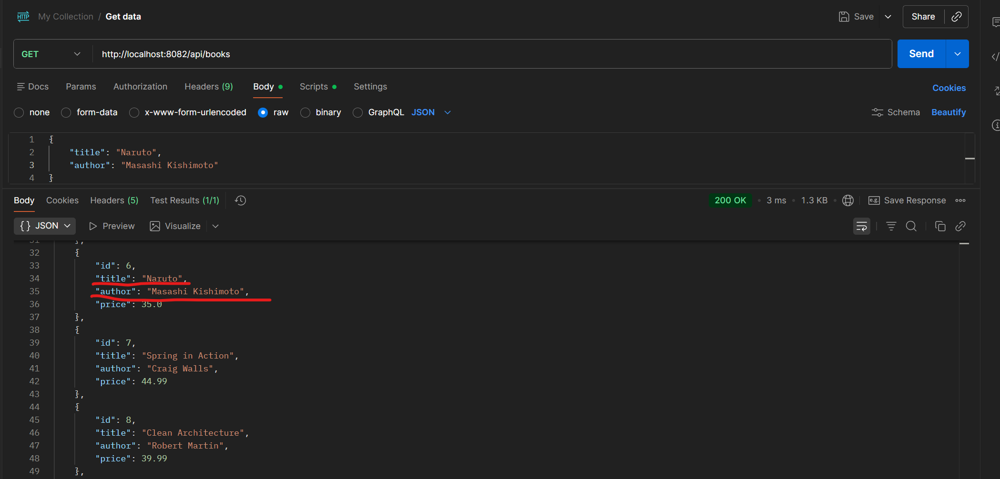
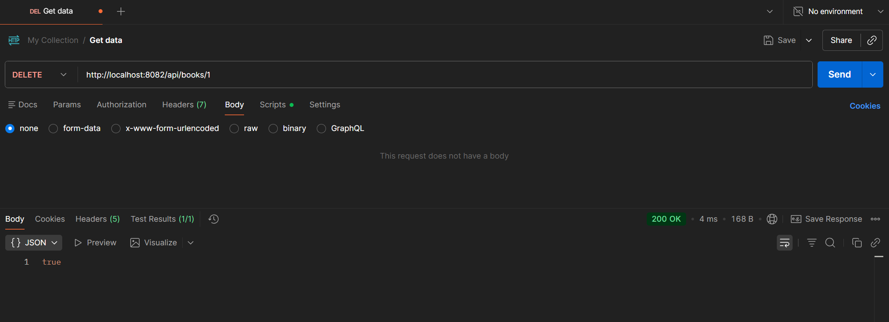
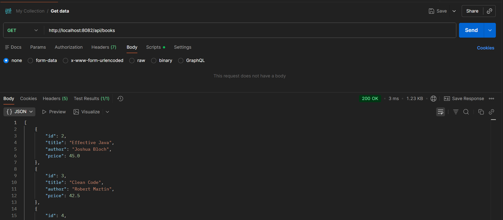
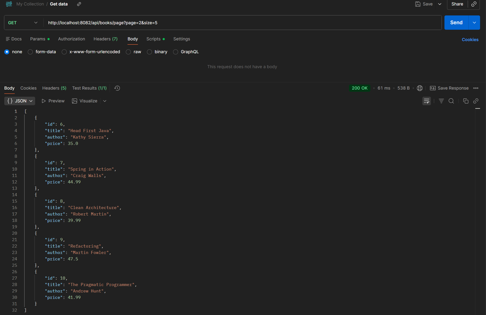
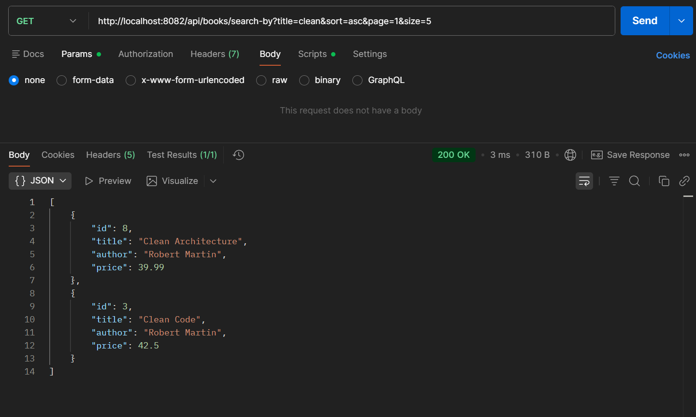

# Book_API_Endpoint_Features

**PUT endpoint (update books)**

Prove it works by using GET books list again:

**PATCH endpoint (partial update)**

Prove it works with GET:

**DELETE endpoint (remove book)**

Prove id 1 book has been removed from JSON

**GET endpoint with pagination**

**Advanced GET endpoint with filtering, sorting, and pagination combined in valid order**

Author: Toan Tran
